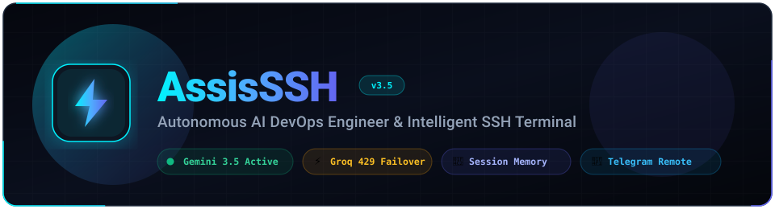
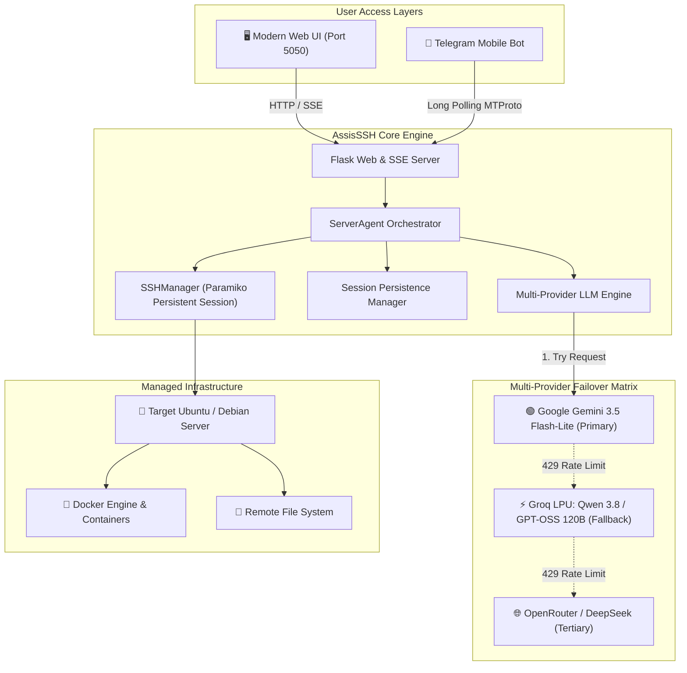

<p align="center">
  
</p>

<p align="center">
  <a href="https://github.com/Yahia-Elhamzawy/AssisSSH">
    
  </a>
</p>

<p align="center">
  
  
  
  
  
  
</p>

---

## 🌟 Overview

**AssisSSH** (Assistant + SSH) is an open-source, autonomous AI DevOps agent and modern web terminal that connects to your remote Linux servers via SSH. It bridges high-level problem descriptions with low-level kernel execution, providing hands-off diagnostic, maintenance, and self-healing server operations.

Equipped with a **Multi-Provider Failover Engine**, **Atomic Session Persistence**, and a **Mobile Telegram Companion**, AssisSSH ensures your infrastructure is always monitored, resilient, and responsive.

### 🎬 Live Autonomous Workflow Simulation

<p align="center">
  
</p>

---

## ⚡ Key Highlights

### 1. 🤖 Autonomous Goal-Oriented AI Agent
- Converts high-level instructions (e.g., *"Clean up dangling Docker images and verify available disk space"*) into multi-step SSH executions.
- **Self-Healing Diagnostics**: If a command fails, the agent analyzes `stderr`, re-evaluates the environment, and attempts alternative remedies.
- **Live Internet Research**: Performs real-time web searches to resolve unfamiliar Linux error signatures, systemd unit failures, and package dependency conflicts.
- **Configurable Safety Step Limiter**: Customizable steps per goal (default `20`, adjustable `5` to `100`).

### 2. 🛡️ Multi-Provider 429 Automatic Failover
Never suffer from API rate limit locks in critical DevOps incidents:
- **Primary**: Google **Gemini 3.5 Flash-Lite** (2026 flagship high-quota engine).
- **Secondary (Zero-Latency Fallback)**: **Groq LPU** running ultra-fast open models (`qwen/qwen3.8-27b` & `openai/gpt-oss-120b`).
- **Tertiary Backup**: **OpenRouter / DeepSeek** API routing.
- **Bi-directional Tool Translation**: Transparently maps tool schemas between Google GenAI Function Calling and OpenAI Tool Calling specifications.

### 3. 📂 Persistent Disk Sessions (Never Lose Context)
- Every user turn, model thought process, executed command, and final summary is atomically serialized to `sessions/{session_id}.json`.
- Sessions survive server reboots and browser refreshes.
- Dedicated **Sessions History Modal (`📂 الجلسات`)** allows quick switching between past tasks, creating clean workspaces, or auditing previous incidents.

### 4. 🖥️ Authentic Monospace Web Terminal
- Full Linux shell interactivity with strict LTR visual rendering.
- Real-time directory awareness (`pwd` tracking across `cd` commands).
- Quick command autocompletion for standard Linux and Docker CLI operations.
- Single-click sudo elevation toggle, exportable terminal session logs, and font scaling.

### 5. 🐳 Docker Fleet Visual Dashboard
- Real-time container discovery and status cards (Running, Stopped, Restarting).
- Live container resource tracking and 1-click tailing of logs (`docker logs --tail 100`).
- Safe Docker system prune triggers and quick actions.

### 6. 📱 Secure Telegram Bot Remote Control
- Whitelisted authorization matching your Telegram username (`@Yahya_el_hamzawy`).
- Execute instant commands: `/run <command>`, `/sh <script>`, `/stats`, `/reboot`.
- Trigger autonomous goals from mobile chat and receive formatted Markdown summaries and status alerts.

---

## 🏗️ Architecture



---

## 🚀 Quick Start

### Prerequisites
- Python 3.10+ installed
- SSH access to a Linux server (Ubuntu/Debian recommended)
- A Google Gemini API Key ([Google AI Studio](https://aistudio.google.com/))
- *(Recommended)* A Groq API Key ([Groq Console](https://console.groq.com/)) for instant zero-rate-limit fallback

### 1. Clone the Repository
```bash
git clone https://github.com/Yahia-Elhamzawy/AssisSSH.git
cd assissh
```

### 2. Set Up Virtual Environment & Dependencies
```bash
# Create virtual environment
python -m venv venv

# Activate virtual environment
# On Linux / macOS:
source venv/bin/activate
# On Windows (PowerShell):
.\venv\Scripts\Activate.ps1

# Install requirements
pip install -r requirements.txt
```

### 3. Configure Environment Variables
Copy `.env.example` to `.env`:
```bash
cp .env.example .env
```
Edit `.env` with your API keys:
```env
# Primary LLM Engine
GEMINI_API_KEY=your_gemini_api_key_here

# Zero-Interruption 429 Fallback Engines
GROQ_API_KEY=your_groq_api_key_here
OPENROUTER_API_KEY=your_openrouter_or_deepseek_key_here

# Application Port (Default: 5050)
PORT=5050

# Telegram Bot Companion (Optional)
TELEGRAM_BOT_TOKEN=your_telegram_bot_token_here
TELEGRAM_ALLOWED_USER=your_telegram_username_without_at
```

### 4. Launch AssisSSH
```bash
python app.py
```
Open your browser and navigate to:
```
http://localhost:5050
```

---

## 🐳 Docker Deployment

Run AssisSSH inside an isolated Docker container with one command:

```bash
docker compose up -d --build
```
Your containerized AssisSSH instance will be accessible at `http://localhost:5050`.

---

## 📡 REST API Reference

| Endpoint | Method | Description |
| :--- | :---: | :--- |
| `/api/connect` | `POST` | Authenticate and open persistent SSH session to target host |
| `/api/disconnect` | `POST` | Terminate the active SSH connection |
| `/api/status` | `GET` | Get current connection status, host, user, latency, and cwd |
| `/api/solve` | `GET` (SSE) | Stream autonomous AI solver loop execution events (Server-Sent Events) |
| `/api/stop` | `POST` | Emergency brake: immediately halt running AI execution loop |
| `/api/sessions` | `GET` | Retrieve list of all saved sessions and turns metadata |
| `/api/session/<id>` | `GET` | Retrieve full turn history and context for a specific session |
| `/api/session/new` | `POST` | Initialize a brand-new persistent session workspace |
| `/api/session/<id>` | `DELETE`| Remove a session and its disk history permanently |
| `/api/settings` | `GET/POST`| Fetch or update runtime settings (`max_steps`) |
| `/api/docker/list` | `GET` | Enumerate active and stopped Docker containers |
| `/api/docker/action` | `POST` | Perform lifecycle actions on containers (`start`, `stop`, `restart`, `prune`) |
| `/api/docker/logs` | `GET` | Fetch container stdout/stderr log stream |

---

## 🇸🇦 الدليل باللغة العربية (Arabic Quick Guide)

<details>
<summary><b>اضغط هنا لقراءة الدليل وخيارات الاستخدام باللغة العربية 📖</b></summary>

### ما هو AssisSSH؟
**AssisSSH** هو وكيل ذكاء اصطناعي وتيرمينال ويب متكامل لإدارة خوادم لينكس والـ DevOps عن بُعد عبر بروتوكول SSH. يقوم بتحويل المهام المكتوبة باللغة الطبيعية (بالعربية أو الإنجليزية) إلى أوامر فعلية تنفذ على السيرفر، مع فحص النتائج ومعالجة الأخطاء ذاتياً.

### أهم المميزات:
1. **التبديل التلقائي عند تجاوز الكوتة (Automatic 429 Fallback)**:
   - يعمل بشكل أساسي مع أحدث موديلات Google لعام 2026: `gemini-3.5-flash-lite`.
   - عند حدوث أي خطأ كوتة (429 Rate Limit)، يتحول تلقائياً وفورياً إلى معالجات **Groq** السريعة ثم **OpenRouter / DeepSeek** دون أن تفشل المهمة أو تتوقف.
2. **حفظ واسترجاع الجلسات (Session Persistence)**:
   - تُحفظ كل مهمة وأفكار الوكيل والأوامر المنفذة في ملفات JSON على القرص.
   - يمكنك تصفح الجلسات السابقة، فتح جلسة جديدة بذاكرة مستقلة، أو حذف الجلسات القديمة بسهولة عبر نافذة `📂 الجلسات`.
3. **تيرمينال ويب تفاعلي حقيقي**:
   - واجهة Monospace سريعة، دعم كامل لتتبع المسار الحالي `cwd`، تكملة الأوامر تلقائياً Tab Completion، وتفعيل/تعطيل صلاحيات `sudo`.
4. **لوحة تحكم في حاويات Docker**:
   - متابعة استهلاك الموارد وفحص لوجات الحاويات بنقرة واحدة وتنظيف المخلفات Prune.
5. **بوت تليجرام مشفر ومحمي**:
   - التحكم في السيرفر وتوجيه الأوامر والوكيل مباشرة من هاتفك عبر التليجرام مع تقييد الوصول لاسم المستخدم الخاص بك فقط.

### التشغيل السريع:
```bash
git clone https://github.com/Yahia-Elhamzawy/AssisSSH.git
cd assissh
python -m venv venv
.\venv\Scripts\Activate.ps1  # أو source venv/bin/activate
pip install -r requirements.txt
python app.py
```
افتح المتصفح على: `http://localhost:5050`
</details>

---

## 🛠️ Project Structure

```
assissh/
├── app.py                  # Core Flask server, SSE streaming & REST API
├── agent.py                # ServerAgent loop, tool schemas, and goal execution
├── llm_providers.py        # Multi-Provider fallback matrix (Gemini -> Groq -> OpenRouter)
├── session_manager.py      # Atomic session persistence engine & serialization
├── ssh_manager.py          # Paramiko SSH connection, streaming & interactive shell
├── telegram_bot.py         # Secured Telegram companion integration
├── requirements.txt        # Python package dependencies
├── .env.example            # Environment configuration template
├── sessions/               # Persistent JSON session storage directory
├── static/
│   ├── app.js              # Next-gen client engine, terminal & sessions logic
│   ├── style.css           # Obsidian glassmorphic UI design system
│   └── marked.min.js       # Fast client-side markdown rendering
└── templates/
    └── index.html          # Single-page terminal & AI copilot interface
```

---

## 🤝 Contributing

Contributions, issues, and feature requests are welcome!
Feel free to check the [issues page](https://github.com/Yahia-Elhamzawy/AssisSSH/issues).

1. Fork the Project
2. Create your Feature Branch (`git checkout -b feature/AmazingFeature`)
3. Commit your Changes (`git commit -m 'Add some AmazingFeature'`)
4. Push to the Branch (`git push origin feature/AmazingFeature`)
5. Open a Pull Request

---

## 📄 License

Distributed under the **MIT License**. See `LICENSE` for more information.

<p align="center">
  Built with ❤️ for DevOps Engineers & SysAdmins worldwide.
</p>
